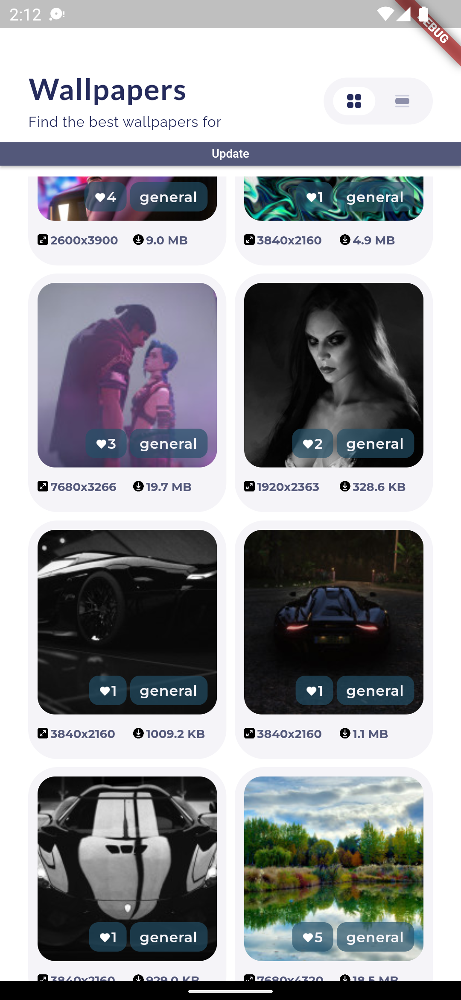

# flutter_setup_walpapers

The project is made on the design in figma: https://www.figma.com/file/7Aj74aN6xWEBBl1lzA65RT/UI-test?node-id=104%3A671

Samples:

initial loading

  

grid screen

  

list screen

  

detail screen

  

download image

  

set wallpaper home screen

  

wallpapers in cache

  

The project was made using the bloc package. Screens only work in portrait mode. Implemented loading a list of photos from a third-party api https://wallhaven.cc/help/api. There is automatic pagination when scrolling down. When displaying photos, different resolutions are used. Implemented data caching in sqlflite. Also switch between list and grid to match the design.

The second screen displays a detailed photo. The download button downloads the photo to the phone's memory as bytes using the shared_preferences package. After downloading using the wallpaper package, you can set the photo as wallpaper on the main screen of your smartphone. Unfortunately only on android you can set the wallpaper.